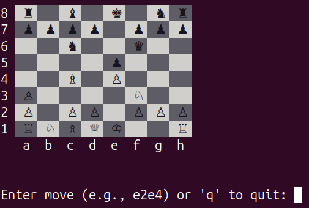

# cchess
**cchess** is a lightweight, high-performance chess engine written in pure C. The project focuses on the efficiency of low-level programming to handle complex move generation and position evaluation.



Picture 1. Example of visuals of the project at the current state.

## Current features
* **bitboard engine**: core board representation using 64-bit integers for lightning-fast bitwise operations.
* **ANSI terminal UI**: a custom-built terminal interface featuring colored cells and Unicode symbols for pieces.
* **move generation**: efficient calculation of legal moves using bitwise shifts and masks to maximize performance.

## Future features
* **parser of user input**: conversion of Long Algebraic Notation strings into internal bitboard moves.
* **position evaluation**: implementation of material weights and piece-square tables for tactical assessment.
* **search algorithm**: minimax search with alpha-beta pruning to find the optimal move.

## Usage
1. Clone the repository:
```bash
git clone https://github.com/Andrew3378o/cchess.git
cd cchess
```
2. Build the project:
```bash
mkdir build
cd build
cmake ..
make
```
3. Execute the programm:
```bash
./cchess
```
