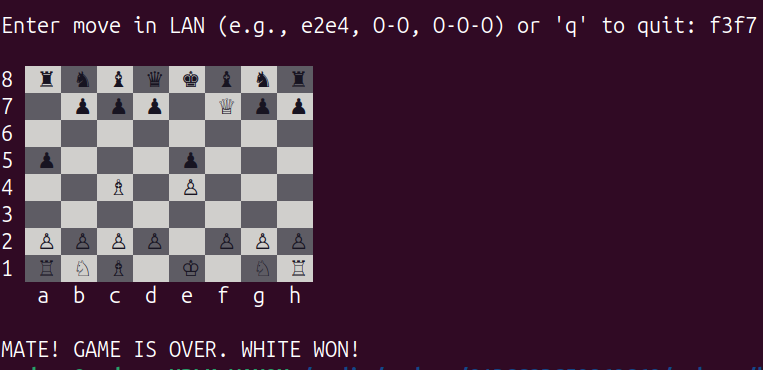

# cchess

> **Language:** **English** | [Українська](README.uk.md)

**cchess** is a lightweight, high-performance chess engine written in pure C. The project focuses on the efficiency of low-level programming to handle complex move generation and position evaluation.



---

## Table of Contents

- [Objective](#objective)
- [Implementation Overview](#implementation-overview)
- [System Calls Used](#system-calls-used)
- [Build & Run](#build--run)
- [Usage Example](#usage-example)
- [Current Features](#current-features)
- [Conclusion](#conclusion)

---

## Objective

The goal of this project is to develop a fully functional chess engine in C that runs from the Linux command line. The program demonstrates the use of low-level programming techniques: bitboards for chess position representation, magic bitboards for sliding piece move generation, and Zobrist hashing for repetition detection. The program performs system call error checking and terminates correctly in all edge cases.

---

## Implementation Overview

The project consists of six modules:

### `src/main.c` — Entry Point and Game Loop
Initializes all subsystems (starting position, knight move tables, magic bitboards, Zobrist keys). Implements the main game loop: reads a move from the user in LAN (Long Algebraic Notation) format, validates its format and legality, executes it, and determines the game state (checkmate, stalemate, draw).

### `src/move.c` — Move Generation and Execution
Implements generation of all pseudo-legal and legal moves for every piece type using bitwise operations. Supports castling, en passant, and pawn promotion.

### `src/magic.c` — Magic Bitboards
Pre-computes attack tables for rooks and bishops using the magic bitboard algorithm, providing O(1) access to sliding piece moves in any position.

### `src/zobrist.c` — Position Hashing
Generates a unique 64-bit hash for each position (accounting for piece placement, castling rights, en passant square, and side to move). Used for detecting position repetitions.

### `src/print.c` and `src/position.c` — Display and Initialization
Renders the chess board in the terminal with ANSI color formatting and Unicode piece symbols. Initializes the starting position using bitmasks.

---

## System Calls Used

The program uses the following system calls (directly or through the standard C library):

| System Call | libc Function | Used In | Description |
|---|---|---|---|
| `write` | `printf` | `print.c`, `main.c` | Outputs the board, game state messages, and prompts to standard output (`stdout`, fd=1) |
| `read` | `scanf` | `main.c` | Reads the user's move from standard input (`stdin`, fd=0) |
| `brk` / `mmap` | implicitly via `libc` | initialization | Memory allocation for static tables (magic bitboards, move tables) |
| `exit_group` | `return` from `main` | `main.c` | Clean process termination after the `q` command or end of game |

---

## Build & Run

### Requirements
- Linux (Ubuntu 20.04+)
- GCC or Clang
- CMake >= 3.10

### Build Steps

```bash
git clone https://github.com/Andrew3378o/cchess.git
cd cchess
mkdir build
cd build
cmake ..
make
./cchess
```

---

## Usage Example

```
Initializing starting position...

Initializing knights moves...

Initializing magic bitboards...

Initializing zobrist keys...


8  ♜  ♞  ♝  ♛  ♚  ♝  ♞  ♜ 
7  ♟  ♟  ♟  ♟  ♟  ♟  ♟  ♟ 
6                         
5                         
4                         
3                         
2  ♙  ♙  ♙  ♙  ♙  ♙  ♙  ♙ 
1  ♖  ♘  ♗  ♕  ♔  ♗  ♘  ♖ 
   a  b  c  d  e  f  g  h 


Enter move in LAN or 'q' to quit: e2e4

8  ♜  ♞  ♝  ♛  ♚  ♝  ♞  ♜ 
7  ♟  ♟  ♟  ♟  ♟  ♟  ♟  ♟ 
6                         
5                         
4              ♙          
3                         
2  ♙  ♙  ♙  ♙     ♙  ♙  ♙ 
1  ♖  ♘  ♗  ♕  ♔  ♗  ♘  ♖ 
   a  b  c  d  e  f  g  h 


Enter move in LAN or 'q' to quit: e7e5

8  ♜  ♞  ♝  ♛  ♚  ♝  ♞  ♜ 
7  ♟  ♟  ♟  ♟     ♟  ♟  ♟ 
6                         
5              ♟          
4              ♙          
3                         
2  ♙  ♙  ♙  ♙     ♙  ♙  ♙ 
1  ♖  ♘  ♗  ♕  ♔  ♗  ♘  ♖ 
   a  b  c  d  e  f  g  h 


Enter move in LAN or 'q' to quit: q
Exiting the engine...

```

---

## Current Features

- **Bitboard engine:** position represented as 64-bit integers for fast bitwise operations
- **ANSI terminal UI:** colored squares and Unicode symbols for pieces
- **Move generation:** all legal moves for every piece type, including castling and en passant
- **Input parser:** converts LAN strings into internal move representation
- **Check, checkmate and stalemate detection:** determines terminal positions
- **Draw conditions:** draw by repetition and insufficient material
- **Zobrist hashing:** efficient position hashing for repetition detection

---

## Conclusion

In the course of this project, a fully functional chess engine was developed in C, running from the Linux command line. The following key components were implemented: bitboards for fast position representation, magic bitboards for sliding piece move generation, and Zobrist hashing for repetition detection.

The program correctly handles all input errors (invalid move format, illegal move, EOF) and terminates cleanly in all edge cases. Interaction with the operating system is done via the `read` (through `scanf`) and `write` (through `printf`) system calls, whose return values are checked at every critical point.

The project demonstrates the effective application of low-level C programming techniques in a Linux system environment.
